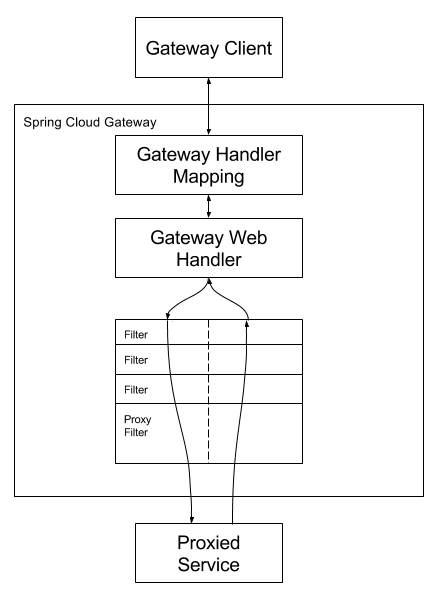

#### 一、依赖引入

- 结合Spring-Cloud-Alibaba使用 2.2.0.RELEASE版本对应Cloud的Hoxton.SR3版本

  ```xml
  <dependencyManagement>
      <dependencies>
          <!-- spring cloud Hoxton.SR3 -->
          <dependency>
              <groupId>org.springframework.cloud</groupId>
              <artifactId>spring-cloud-dependencies</artifactId>
              <version>Hoxton.SR3</version>
              <type>pom</type>
              <scope>import</scope>
          </dependency>
          <!-- spring cloud alibaba 2.2.0.RELEASE -->
          <dependency>
              <groupId>com.alibaba.cloud</groupId>
              <artifactId>spring-cloud-alibaba-dependencies</artifactId>
              <version>2.2.0.RELEASE</version>
              <type>pom</type>
              <scope>import</scope>
          </dependency>
      </dependencies>
  </dependencyManagement>
  ```

- 引入网关依赖

  ```xml
  <!-- spring cloud gateway -->
  <dependency>
      <groupId>org.springframework.cloud</groupId>
      <artifactId>spring-cloud-starter-gateway</artifactId>
  </dependency>
  ```

- 引入注册中心

  ```xml
  <!-- nacos 服务注册中心 -->
  <dependency>
      <groupId>com.alibaba.cloud</groupId>
      <artifactId>spring-cloud-starter-alibaba-nacos-discovery</artifactId>
  </dependency>
  ```

- 引入配置中心

  ```xml
  <!-- nacos 统一配置中心 -->
  <dependency>
      <groupId>com.alibaba.cloud</groupId>
      <artifactId>spring-cloud-starter-alibaba-nacos-config</artifactId>
  </dependency>
  ```

  

  

#### 二、注册中心与配置中心设置

- 注册中心配置 application.properties

  ```properties
  # 注册中心地址
  spring.cloud.nacos.discovery.server-addr=localhost:8848
  # 应用名称[微服务必须]
  spring.application.name=shadow-gateway
  ```

  >  启动类开启服务发现：@EnableDiscoveryClient

  

- 配置中心配置 bootstrap.properties

  ```properties
  # 应用名称[微服务必须]
  spring.application.name=shadow-gateway
  # 配置中心地址
  spring.cloud.nacos.config.server-addr=localhost:8848
  # 配置中心命名空间[环境区分]
  spring.cloud.nacos.config.namespace=2db42c13-8aaf-431a-9e33-fa123605a8b5
  ```

  


#### 三、网关配置结合官网说明配置

- ##### 三大核心

  - ###### Route

    > 网关的基本构件。它由ID、目标URI、Predicate和Filter集合组成

  - ###### Predicate

    > 类似 JAVA8 断言函数，这使您可以匹配来自HTTP请求的任何内容，例如头或参数，返回true或false，true表示匹配成功，请求可以通过，false则相反

  - ###### Filter

    > 您可以在发送下游请求之前或之后修改请求和响应

- ##### 官网示意图

  

- ##### 两种配置方式

  > 配置Predicate和Filter有两种方法:快捷方式和完全展开的参数

  - Shortcut Configuration
  - Fully Expanded Arguments

  

- ##### Route 配置

  ```yaml
  spring:
    cloud:
      gateway:
        routes:
        - id: after_route # ID属性，唯一标识
         uri: lb://renren-fast  # 匹配成功要请求的服务
         predicates:
         - Cookie=mycookie,mycookievalue
         filters:
         - RewritePath=/api/(?<segment>/?.*), /renren-fast/$\{segment} # 路径重写
         - AddResponseHeader=X-Response-Red, Blue
  ```

  > - id 保证唯一即可
  > - uri 服务名称 lb 表示负载均衡
  > - predicates 断言
  > - filters 过滤

- ##### Predicate 配置

  > 作为Spring WebFlux HandlerMapping基础设施的一部分，Spring Cloud Gateway匹配路由。Spring Cloud Gateway包含许多内置的路由断言工厂。所有这些断言都匹配HTTP请求的不同属性。您可以将多个路由断言工厂与逻辑和语句组合在一起。

  - ###### After

    ```yaml
    spring:
      cloud:
        gateway:
          routes:
          - id: after_route
            uri: https://example.org
            predicates:
            - After=2017-01-20T17:42:47.789-07:00[America/Denver]
    ```

    > 当前时间超过设置时间后返回true

    

  - ###### Before
  
    ```yaml
    spring:
      cloud:
        gateway:
          routes:
          - id: before_route
            uri: https://example.org
            predicates:
          - Before=2017-01-20T17:42:47.789-07:00[America/Denver]
    ```

    > 当前时间在设置时间之前返回true

    
  
  - ###### Between
  
    ```yaml
    spring:
      cloud:
        gateway:
          routes:
          - id: between_route
          uri: https://example.org
            predicates:
          - Between=2017-01-20T17:42:47.789-07:00[America/Denver], 2017-01-21T17:42:47.789-07:00[America/Denver]
    ```

    > 当前时间在设置时间之间返回true
  
    
  
  - ###### Cookie
  
    ```yaml
    spring:
      cloud:
        gateway:
        routes:
          - id: cookie_route
          uri: https://example.org
            predicates:
          - Cookie=chocolate, ch.p
    ```
  
    > 请求必须带有 Cookie的key为chocolate，值为ch.p返回true
  
    
  
  - ###### Header
  
    ```yaml
    spring:
    cloud:
        gateway:
        routes:
          - id: header_route
          uri: https://example.org
            predicates:
            - Header=X-Request-Id, \d+
    ```
  
    > 请求头必须带有 X-Request-Id 参数，匹配\d+即数字返回true
  
    
  
  - ###### Host
  
  ```yaml
    spring:
    cloud:
        gateway:
        routes:
          - id: host_route
            uri: https://example.org
            predicates:
            - Host=**.somehost.org,**.anotherhost.org
    ```
  
    > 请求Host 必须满足指定子串返回true
  
    
  
- ###### Method
  
  ```yaml
    spring:
    cloud:
        gateway:
          routes:
          - id: method_route
            uri: https://example.org
            predicates:
            - Method=GET,POST
    ```
  
    > 请求方式必须是指定的GET，POST返回true
  
  
  
- ###### Path
  
  ```yaml
    spring:
      cloud:
        gateway:
          routes:
          - id: path_route
            uri: https://example.org
            predicates:
            - Path=/red/{segment},/blue/{segment}
    ```
  
  > 如果请求路径为，例如:/red/1或/red/blue或/blue/green，则此路由匹配
  
  
  
- ###### Query
  
    ```yaml
    spring:
      cloud:
        gateway:
          routes:
          - id: query_route
            uri: https://example.org
            predicates:
            - Query=green
  ```
  
  > 请求参数必须包含 green 参数返回true
  
  
  
  - ###### RemoteAddr
  
    ```yaml
    spring:
      cloud:
        gateway:
          routes:
          - id: remoteaddr_route
            uri: https://example.org
            predicates:
            - RemoteAddr=192.168.1.1/24
    ```
  
  > 如果请求的远程地址是192.168.1.10，则此路由匹配。
  
    
  
  - ###### Weight
  
    ```yaml
    spring:
      cloud:
        gateway:
          routes:
          - id: weight_high
            uri: https://weighthigh.org
            predicates:
            - Weight=group1, 8
          - id: weight_low
            uri: https://weightlow.org
            predicates:
            - Weight=group1, 2
    ```
  
    > 这条路线将80%的流量转发到weigh.org, 20%的流量转发到weighlow.org


- ##### Filter 配置

  > 路由过滤器允许以某种方式修改传入的HTTP请求或传出的HTTP响应。路由过滤器的作用域是特定的路由。Spring Cloud Gateway包含许多内置的网关过滤器工厂。以下是常用的，更多内容见 [官网](https://cloud.spring.io/spring-cloud-static/spring-cloud-gateway/2.2.2.RELEASE/reference/html/#gatewayfilter-factories)

  - ###### RewritePath

    ```yaml
  spring:
      cloud:
        gateway:
          routes:
          - id: rewritepath_route
            uri: https://example.org
            predicates:
            - Path=/foo/**
            filters:
            - RewritePath=/red(?<segment>/?.*), $\{segment}
    ```
    
    > 对于/red/blue的请求路径，这将在发出下游请求之前将路径设置为/blue。注意，由于YAML规范的原因，应该将$替换为$\
    
    
    
  - ###### AddRequestHeader
  
    ```yaml
  spring:
      cloud:
        gateway:
          routes:
          - id: add_request_header_route
            uri: https://example.org
            filters:
            - AddRequestHeader=X-Request-red, blue
    ```
    
    > 在请求发送到下游前增加请求头 X-Request-red ，值为 blue
    
    
  - ###### RemoveRequestHeader
  
    ```yaml
    spring:
      cloud:
        gateway:
          routes:
          - id: removerequestheader_route
            uri: https://example.org
            filters:
            - RemoveRequestHeader=X-Request-Foo
    ```
  
    > 这将在X-Request-Foo头被发送到下游之前删除它。
  
    
  
  - ###### AddRequestParameter
  
    ```yaml
    spring:
      cloud:
        gateway:
          routes:
          - id: add_request_parameter_route
            uri: https://example.org
            filters:
            - AddRequestParameter=red, blue
    ```
  
    > 这将为所有匹配的请求在下游请求的查询字符串中添加red=blue
  
    
  
  - ###### RemoveRequestParameter
  
    ```yaml
    spring:
      cloud:
        gateway:
          routes:
          - id: removerequestparameter_route
            uri: https://example.org
            filters:
            - RemoveRequestParameter=red
    ```
  
    > 这将在red参数被发送到下游之前删除它。
  
    
  
  - ###### AddResponseHeader
  
    ```yaml
    spring:
      cloud:
        gateway:
          routes:
          - id: add_response_header_route
            uri: https://example.org
            filters:
            - AddResponseHeader=X-Response-Red, Blue
    ```
  
    > 在请求响应头信息中增加 X-Response-Red ，值为blue
  
    
  
  - ###### RemoveResponseHeader
  
    ```yaml
    spring:
      cloud:
        gateway:
          routes:
          - id: removeresponseheader_route
            uri: https://example.org
            filters:
            - RemoveResponseHeader=X-Response-Foo
    ```
  
    > 这将在响应返回到网关客户端之前从响应中删除X-Response-Foo标头。
  
    
  
  - ###### PrefixPath
  
    ```yaml
    spring:
      cloud:
        gateway:
          routes:
          - id: prefixpath_route
            uri: https://example.org
            filters:
            - PrefixPath=/mypath
    ```
  
    > 这将为所有匹配请求的路径加上前缀/mypath。因此，对/hello的请求将被发送到/mypath/hello。
    
    
  
  
  
- ##### LoadBalancerClientFilter

  ```yaml
  spring:
    cloud:
      gateway:
        routes:
        - id: myRoute
          uri: lb://service
          predicates:
          - Path=/service/**
  ```

  > 服务实例找不到默认会返回5xx，可以自己配置`spring.cloud.gateway.loadbalancer.use404=true`

  

- ##### 示例

  ```yaml
  # 路由配置 predicates 精确路由配置靠前 - important
  spring:
    cloud:
      gateway:
        routes:
  ### product route
          - id: product_route
            # 负载均衡请求 shadow-product 服务
            uri: lb://shadow-product
            # 匹配 /api/product开头的请求
            predicates:
              - Path=/api/product/**
            filters:
  # 路径重写 RewritePath
  ### http://localhost:88/api/product/category/save
  ### 重写后：http://localhost:88/product/category/save
              - RewritePath=/api/(?<segment>/?.*), /$\{segment} # 路径重写
  ### renren-fast route
          - id: admin_fast
            uri: lb://renren-fast
            predicates:
              - Path=/api/**
            filters:
  # 路径重写 RewritePath           
  ### http://localhost:88/api/captcha.jpg?uuid=xxx
  ### 重写后：http://localhost:88/renren-fast/captcha.jpg?uuid=xxx
              - RewritePath=/api/(?<segment>/?.*), /renren-fast/$\{segment} 
              # 增加响应头部信息 X-Response-Red = Blue
              - AddResponseHeader=X-Response-Red, Blue
  ```

  